# 针对WUTE车队电动方程式赛车开发的智能低压配电板 PDB

# 关于本项目

一款基于STM32F4+FreeRTOS开发的智能低压配电板(PDB,Power Delivery Board)，具体功能如下：

1. 被动的配电过流保护功能（取代保险丝）
2. 具有配电控制与诊断功能，可实时诊断各通道电流情况
3. 接收VCU的CAN报文实习对各设备配电控制和DCDC管理
4. 集成DCDC继电器、激活继电器
5. 带主动防护，包括过流保护、反接保护、TVS保护、过压保护等（仅限PDB_V1.1）

# 设计说明

## 硬件说明

因涉及大电流配电，考虑到设计失误导致炸板烧板，为降低试错成本，方便部分更换，采用控制板和驱动板分板架构设计，板对板连接器连接

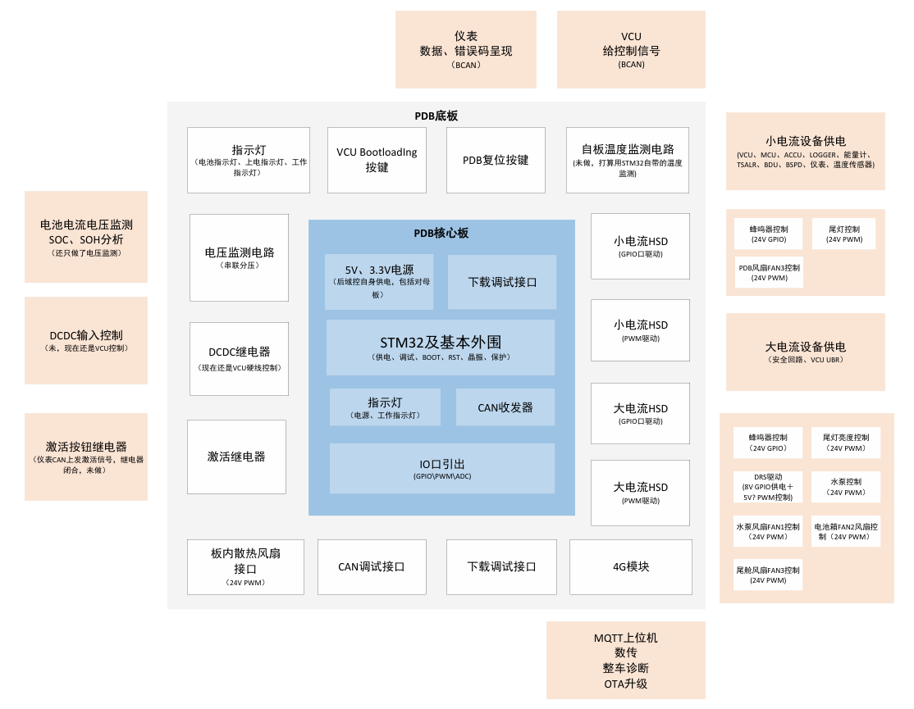

### PDB_V1.0

PDB_V1.0控制板：

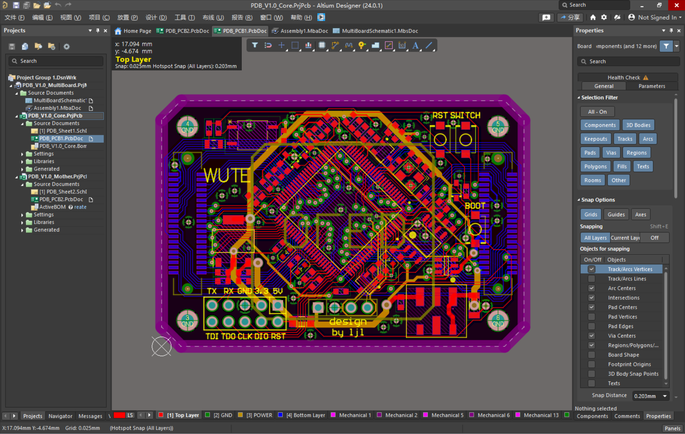

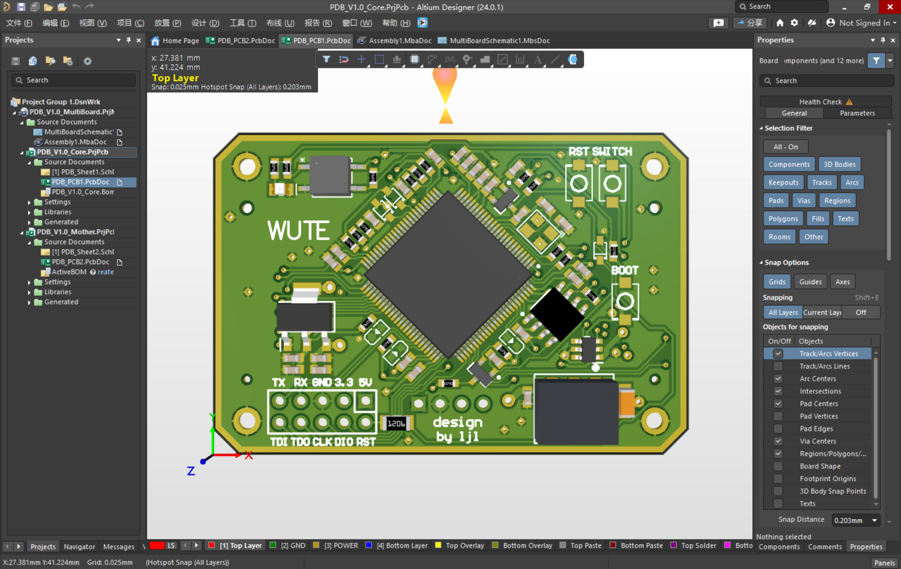

PDB_V1.0驱动板：

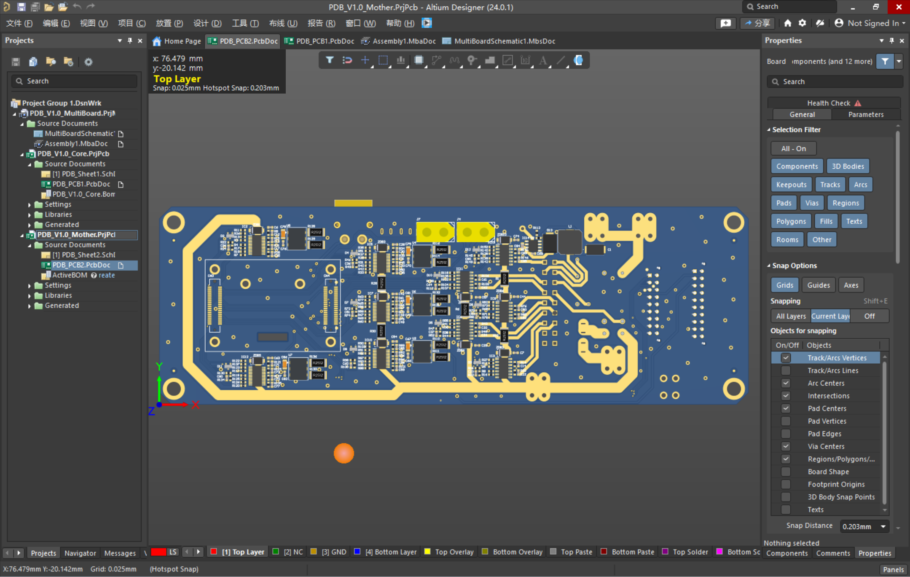

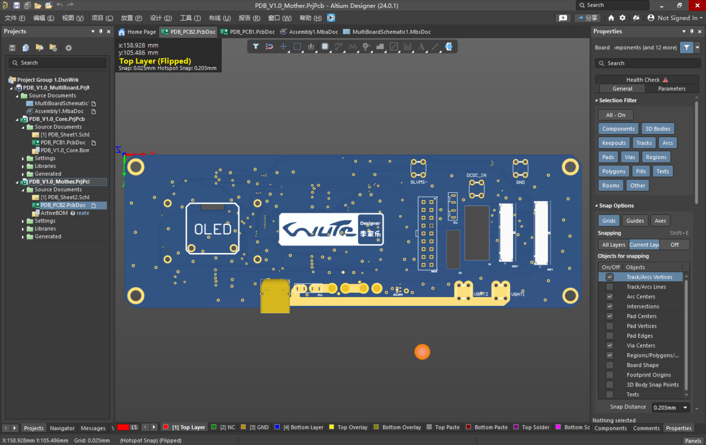

PDB_V1.0_MultiBoard：

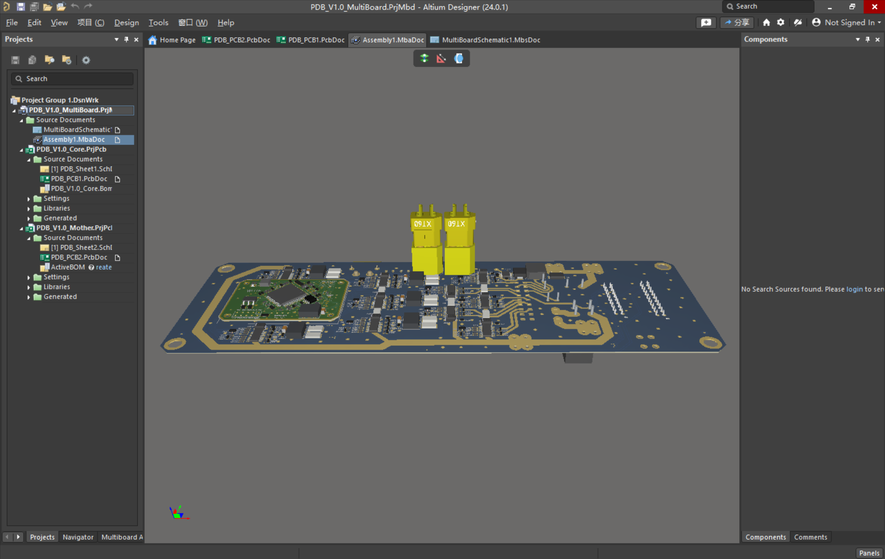

### PDB_V1.1

PDB_V1.1控制板：

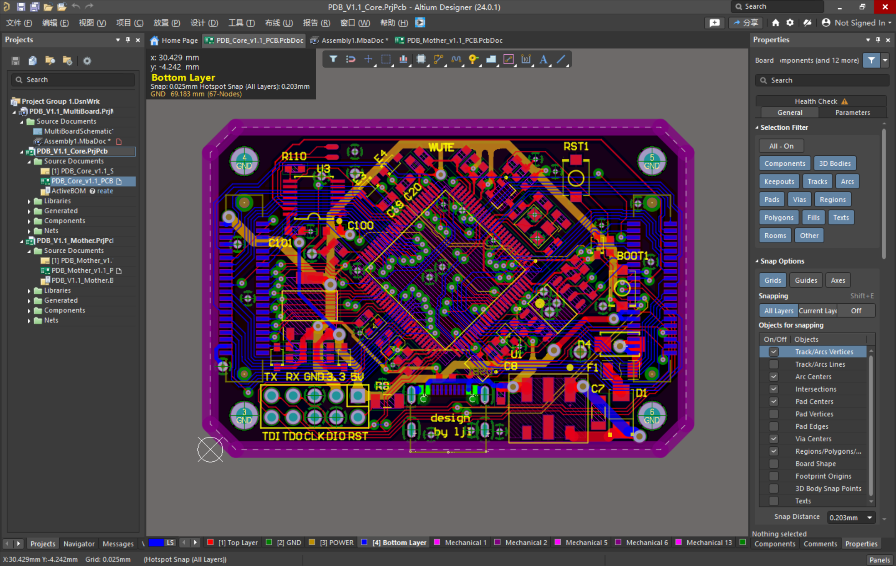

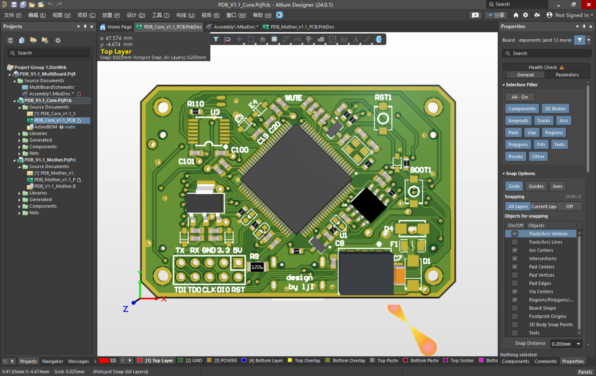

PDB_V1.1驱动板：

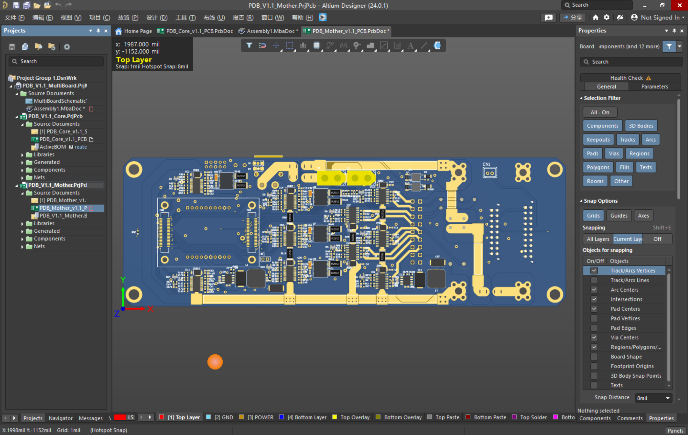

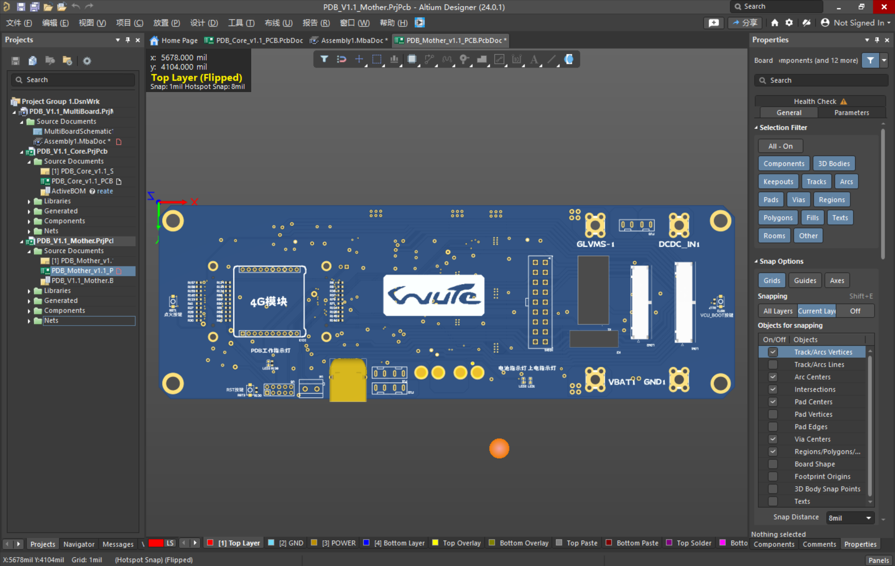

PDB_V1.1_MultiBoard：

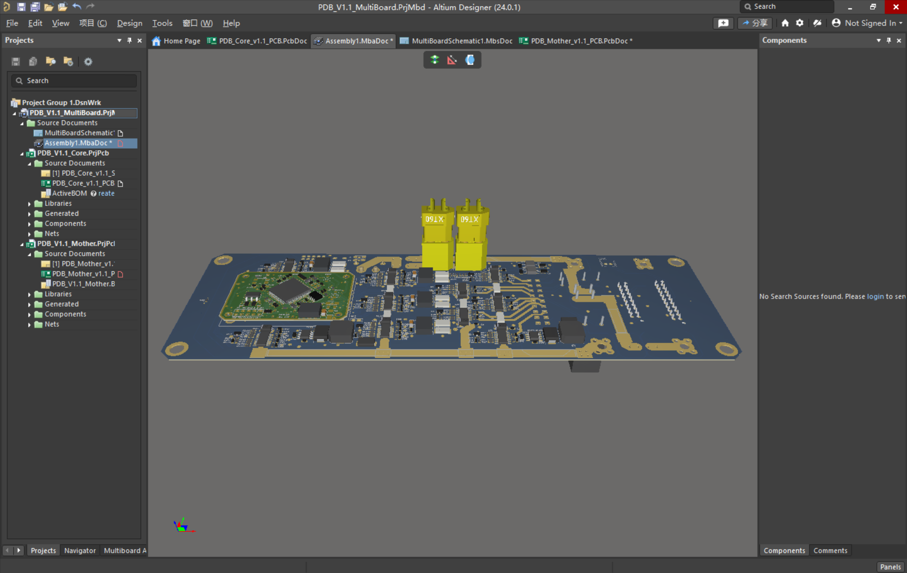

## 软件说明

PDB嵌入式软件基于STM32cubeMX+Keil开发，采用FreeRTOS操作系统

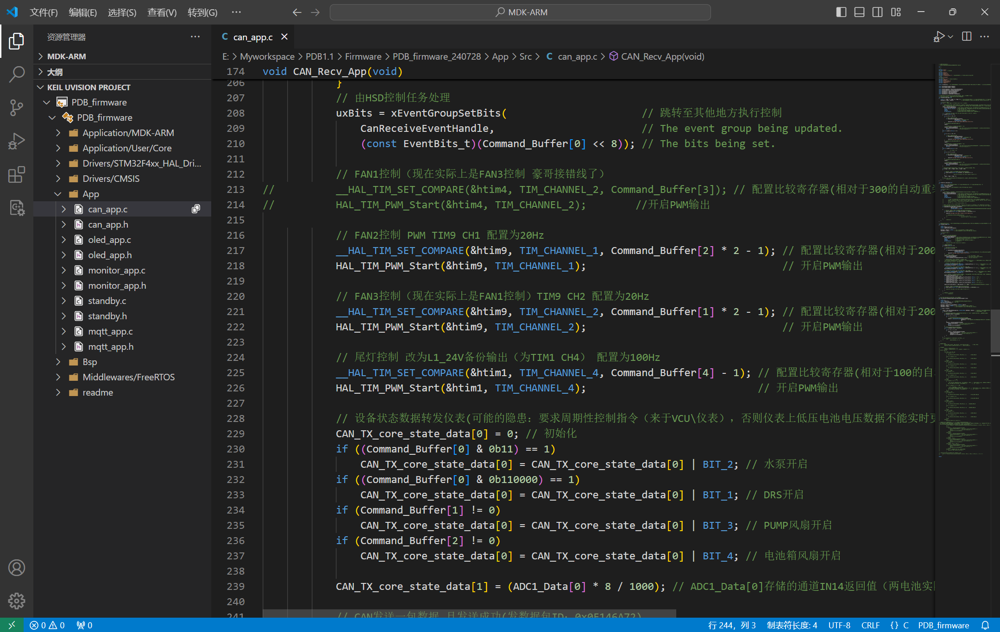

# 实物图

如下图为焊接好的一块PDB可用备件

如下图为PDB和两块12V低压电池封装在一起，布置在赛车尾部

